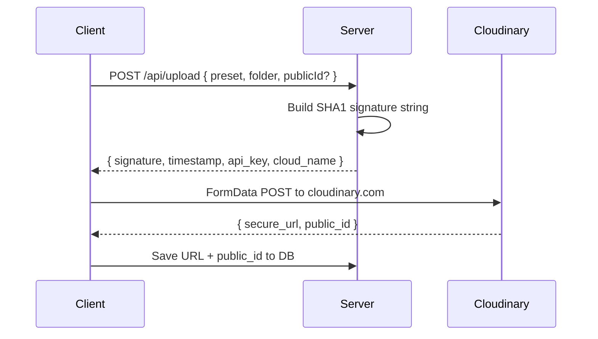

# POS 360 — Deep-Dive Technical Architecture Audit

> **Generated:** 2026-06-16  
> **Last Updated:** 2026-06-18  
> **Project:** POS 360 (shebatech360-nextjs)  
> **Mode:** Single-Tenant Architecture (global scoping)
> **Stack:** Next.js 16 · Prisma 6 · PostgreSQL (Neon) · Auth.js v5 · Tailwind v3 · shadcn/ui · Vitest

> [!NOTE]
> **2026-06-19 Architecture Evolution:**
> This audit document reflects the historic multi-tenant and branch structure as of June 18.
> The architecture has since been evolved to a **Single-Tenant and Branch-less model**.
> - All `shopId` references and dynamic isolation logic have been removed.
> - The `Branch` model has been dropped, shifting multi-location inventory directly to the `Warehouse` structure.
> - For the updated schema and details, please refer to [docs/DATABASE.md](file:///g:/CLIENT%20PROJECT/pos99-main/pos99-main/docs/DATABASE.md).

---

## Executive Summary (2026-06-18 Review)

**Overall maturity: 7.2/10** — Strong architecture and business logic; **not production-ready for public storefront** until P0 security fixes land.

| Status | Finding |
|--------|---------|
| 🔴 **P0** | `middleware.ts` blocks all `/api/*` except `/api/auth/` — public storefront routes (`/api/storefront/*`) return 401 for unauthenticated users |
| 🔴 **P0** | `/api/backup/wipe` has no RBAC — any authenticated user (including CASHIER) can delete all shop data via GET/POST/PUT/PATCH/DELETE |
| 🔴 **P0** | Storefront registration (`POST /api/auth/register`) assigns **CASHIER** role — storefront customers may gain POS dashboard access |
| 🟡 **P1** | Checkout falls back to **localStorage-only fake orders** when API fails — UI shows success but DB is never updated |
| 🟡 **P1** | CI currently fails: 3 ESLint errors + 1 failing unit test (`validation.test.ts`) |
| 🟢 **Strength** | Service layer refactor (sales/products/purchases split), held sales, warehouse-aware stock, Prisma migration pipeline started |

---

## Table of Contents

0. [Executive Summary](#executive-summary-2026-06-18-review)
1. [Database Schema & Relations](#1-database-schema--relations)
2. [Core Business Logic & Transactions](#2-core-business-logic--transactions)
3. [Role-Based Access Control (RBAC)](#3-role-based-access-control-rbac)
4. [Hardware & Third-Party Integration](#4-hardware--third-party-integration)
5. [Performance & Caching](#5-performance--caching)
6. [API Layer & Architecture](#6-api-layer--architecture)
7. [Overall Project Maturity & Recommendations](#7-overall-project-maturity--recommendations)
8. [CI, Tests & Code Quality](#8-ci-tests--code-quality)

---

## 1. Database Schema & Relations

### 1.1 Entity Relationship Summary

| Model | Parent | Relation | On Delete |
|-------|--------|----------|-----------|
| **Shop** | — | Root tenant entity | — |
| **User** | Shop | M:1 (`shopId`) | Restrict |
| **Branch** | Shop | M:1 (`shopId`) | **Cascade** |
| **Category** | Shop | M:1 (`shopId`) | Restrict |
| **Category** (self) | Category | M:1 (`parentId`) | Restrict |
| **Product** | Shop | M:1 (`shopId`) | **Cascade** |
| **ProductImage** | Product | M:1 (`productId`) | **Cascade** |
| **ProductVariant** | Product | M:1 (`productId`) | **Cascade** |
| **BranchStock** | Branch + Product | M:1 (both) | **Cascade** |
| **Customer** | Shop | M:1 (`shopId`) | **Cascade** |
| **Supplier** | Shop | M:1 (`shopId`) | **Cascade** |
| **Sale** | Shop | M:1 (`shopId`) | **Cascade** |
| **SaleItem** | Sale | M:1 (`saleId`) | **Cascade** |
| **SaleTender** | Sale | M:1 (`saleId`) | **Cascade** |
| **Purchase** | Shop | M:1 (`shopId`) | **Cascade** |
| **PurchaseItem** | Purchase | M:1 (`purchaseId`) | **Cascade** |
| **PurchaseTender** | Purchase | M:1 (`purchaseId`) | **Cascade** |
| **FinancialAccount** | Shop | M:1 (`shopId`) | **Cascade** |
| **AccountTransfer** | Shop | M:1 (`shopId`) | Restrict |
| **Expense** | Shop | M:1 (`shopId`) | **Cascade** |
| **StockAdjustment** | Shop | M:1 (`shopId`) | Restrict |
| **Transfer** | Shop | M:1 (`shopId`) | Restrict |
| **AuditLog** | Shop | M:1 (`shopId`) | Restrict |
| **Notification** | Shop | M:1 (`shopId`) | Restrict |
| **CashShift** | Shop | M:1 (`shopId`) | Restrict |
| **SerialNumber** | Shop | M:1 (`shopId`) | Restrict |

### 1.2 Relationship Types

**One-to-Many (most common pattern):**
```
Shop → User, Branch, Category, Product, Customer, Supplier,
        Sale, Purchase, FinancialAccount, Expense, AuditLog,
        Notification, CashShift, Transfer, StockAdjustment

Sale → SaleItem, SaleTender
Purchase → PurchaseItem, PurchaseTender
Product → ProductImage, ProductVariant
```

**Many-to-Many (via junction table):**
```
Branch × Product → BranchStock (junction)
```

**Self-referencing (tree):**
```
Category → Category (parentId → id) — "CategoryTree"
FinancialAccount → FinancialAccount (parentId → id) — "AccountTree"
```

**Polymorphic (via type field):**
```
TenderType: CASH | BANK | BKASH | NAGAD | ROCKET | CARD | DUE | OTHER
  — shared across SaleTender, PurchaseTender
```

### 1.3 Cascade Delete Analysis

**Cascade is applied on:** `Branch`, `Product`, `ProductImage`, `ProductVariant`, `BranchStock`, `Customer`, `Supplier`, `Sale`, `SaleItem`, `SaleTender`, `Purchase`, `PurchaseItem`, `PurchaseTender`, `FinancialAccount`, `Expense`

**Cascade is NOT applied on:** `User`, `Category`, `StockAdjustment`, `Transfer`, `AuditLog`, `Notification`, `CashShift`, `AccountTransfer`, `SerialNumber`

This is intentional — `User` should never be silently deleted when a Shop is removed. `AuditLog` and `Notification` should outlive entities for historical reference.

### 1.4 Key Indexes

- `@@index([shopId])` on every tenant-scoped model ✅
- `@@unique([shopId, slug])` on Product ✅
- `@@unique([shopId, sku])` on Product ✅
- `@@unique([shopId, slug])` on Category ✅
- `@@unique([branchId, productId])` on BranchStock ✅
- `@@index([shopId, channel, createdAt])` on Sale — for storefront ORDER BY
- `@@index([shopId, customerId])` on Sale — for customer-ledger queries
- `@@unique([shopId, serial])` on SerialNumber ✅

**Missing but recommended:**
- `@@index([productId])` on `SaleItem` — for product-level analytics
- `@@index([productId])` on `PurchaseItem` — same
- `@@index([saleId])` on `SaleTender` — already covered by FK
- `@@index([userId])` on `AuditLog` — for user audit trails
- `@@index([shopId, status])` on SerialNumber — for fast IN_STOCK serial counts

### 1.5 Schema Updates (Latest Additions)

- **CategoryBrand/SubcategoryProduct/SubcategoryModel/SubcategorySeries**: Hierarchical product taxonomy (Category → Brand → Product → Model → Series)
- **Product taxonomy FK refactor** (migration `20260617090000_erp_storefront_integrity`): Dropped free-text `brand`, `model`, `series` columns; replaced with `brandId`, `modelId`, `seriesId` FKs to catalog tables. Indexes added on all three FK columns.
- **SerialNumber**: Added `warrantyExpiryDate` field; warranty set on sale, cleared on void.
- **StockAdjustment / Transfer**: Added proper FK constraints to `Branch` and `Warehouse`; `Transfer.fromBranchId` / `toBranchId` now nullable (warehouse-only transfers supported).
- **Customer Transactions**: `CustomerTransaction` model tracks balance changes (sale, payment, refund, adjustment, write-off)
- **Customer Balance**: `Customer.balance` and `Customer.due` fields for wallet/credit management
- **Branch Enhancements**: `Branch.code`, `Branch.isHeadOffice`, `Branch.isActive`
- **Supplier Payments**: `SupplierPayment` model
- **HeldSale**: New model for POS held/parked sales (API: `/api/pos/held-sales`)

---

## 2. Core Business Logic & Transactions

> **2026-06-18 note:** Business logic has been split into focused modules under `src/server/services/sales/`, `products/`, and `purchases/`. Facade files (`salesService.ts`, `productsService.ts`, `purchasesService.ts`) re-export for backward compatibility. Stock validation now supports **warehouse-level** stock via `WarehouseStock` in addition to branch-level stock.

### 2.1 POS Sale Flow — `sales/create.ts`

**UI Entry Point:** `/dashboard/sales/create` (formerly `/dashboard/pos`, which redirects via middleware)  
**API Entry Point:** `POST /api/sales` → `apiHandler` → `salesService.create(ctx, input)`

**Transaction boundary:** `prisma.$transaction()` with 30-second timeout

```
$transaction ─────────────────────────────────────────────────────┐
│                                                                  │
│  STEP 1 — Validate stock                                         │
│    for each item:                                                 │
│      - For serial-tracked products: count IN_STOCK serials      │
│      - For non-serial-tracked: check Product.stock/BranchStock │
│      if insufficient → throw OUT_OF_STOCK                        │
│      productSnapshots.set(id, { cost, name })                     │
│                                                                   │
│  STEP 2 — Calculate totals                                        │
│    subtotal = Σ(price × qty − discount)                           │
│    total = subtotal − input.discount                              │
│    paid   = Σ(tender.amount) (excluding DUE)                     │
│    due    = max(0, total − paid)                                  │
│                                                                   │
│  STEP 3 — Create Sale + Items + Tenders (single create)           │
│    tx.sale.create({                                               │
│      data: { shopId, userId, branchId, customerId,               │
│              channel: "POS", status: "COMPLETED",                 │
│              subtotal, discount, total, paid, due,                │
│              items: { create: [saleItem...] },                    │
│              tenders: { create: [saleTender...] } }               │
│    })                                                             │
│                                                                   │
│  STEP 4 — Decrement stock (Product.stock + BranchStock)          │
│    for each item:                                                 │
│      tx.product.update({ where: { id }, data: { stock: -qty } }) │
│      if branchId: update BranchStock.qty                          │
│                                                                   │
│  STEP 5 — Update customer due/balance (if applicable)             │
│    if customerId:                                                 │
│      - Check credit limit (if due > 0)                            │
│      - Update Customer.due/Customer.balance                       │
│      - Create CustomerTransaction (type: SALE)                    │
│      - If wallet tender used: update balance + create transaction │
│                                                                   │
│  STEP 6 — Assign serial numbers (if trackSerials=true)            │
│    Assign oldest IN_STOCK serials first (FIFO)                    │
│    Update SerialNumber.status → SOLD                              │
│    Sync Product.stock to IN_STOCK serial count (for tracked)     │
│                                                                   │
└───── $transaction commits atomically ────────────────────────────┘

  STEP 7 — Post-process (outside transaction, non-blocking)
    auditLogService.log()
    cache.invalidateSales()
    cache.invalidateProducts()
```

**Key Design Decisions:**

- **Snapshot fields:** `SaleItem.name` and `SaleItem.cost` are snapshotted from Product at time of sale — immune to future price changes.
- **Stock + Customer due in same transaction:** Ensures POS and e-commerce never cause inconsistent state.
- **Serial number tracking:** FIFO assignment for products with `trackSerials=true`, `Product.stock` synced to actual IN_STOCK serial count.
- **Branch-level stock:** Both `Product.stock` and `BranchStock.qty` are updated for multi-branch support.
- **Wallet/advance payments:** Tender type "Wallet" deducts from customer balance/advance.

### 2.2 Void Flow — `salesService.void()`

**Permission:** `requireRole(ctx, "MANAGER")`

```
$transaction ─────────────────────────────────────────────────┐
│                                                              │
│  STEP 1 — Validate                                          │
│    sale = tx.sale.findFirst({ where: { id, shopId } })      │
│    if sale.status !== "COMPLETED" → throw CONFLICT           │
│                                                              │
│  STEP 2 — Restore stock (Product.stock + BranchStock)       │
│    for each item:                                            │
│      tx.product.update({ stock: +item.qty })                 │
│      if branchId: restore BranchStock.qty                    │
│                                                              │
│  STEP 3 — Release serial numbers (back to IN_STOCK)         │
│    tx.serialNumber.updateMany(                               │
│      where: { saleItemId: { in: saleItemIds } },             │
│      data: { status: "IN_STOCK", saleItemId: null }         │
│    )                                                         │
│                                                              │
│  STEP 4 — Reverse customer due/balance                       │
│    if customerId:                                             │
│      - Reverse due amount (if any)                           │
│      - Restore wallet amount (if Wallet tender used)         │
│      - Create CustomerTransaction (type: WRITE_OFF)          │
│                                                              │
│  STEP 5 — Mark VOIDED                                        │
│    tx.sale.update({ status: "VOIDED", notes: reason })       │
│                                                              │
└─────────────────────────────────────────────────────────────┘
```

### 2.3 Refund Flow — `salesService.refund()`

**Permission:** `requireRole(ctx, "MANAGER")`

```
$transaction ─────────────────────────────────────────────────┐
│                                                              │
│  STEP 1 — Validate                                          │
│    sale = tx.sale.findFirst({ where: { id, shopId } })      │
│                                                              │
│  STEP 2 — Selective restock per item (if refundItem.restock)│
│    for each refundItem:                                      │
│      if restock:                                             │
│        - Restore Product.stock and BranchStock              │
│        - Release serial numbers back to IN_STOCK            │
│                                                              │
│  STEP 3 — Update customer balance (refund to wallet)         │
│    if customerId and refundAmount > 0:                       │
│      tx.customer.update({ balance: +refundAmount })         │
│      tx.customerTransaction.create({ type: "REFUND", ... }) │
│                                                              │
│  STEP 4 — Mark REFUNDED                                     │
│    tx.sale.update({ status: "REFUNDED", notes: reason })     │
│                                                              │
└─────────────────────────────────────────────────────────────┘
```

**Note:** Refund updates customer wallet balance, does not reverse tenders.

### 2.4 E-commerce Checkout Flow — `salesService.createStorefrontOrder()`

**Entry Point:** `POST /api/storefront/checkout` → `publicApiHandler` → `createStorefrontOrder()`

**Same data model as POS:** E-commerce orders are stored in the **same `Sale` table** with `channel: "STOREFRONT"`. There is no separate `StorefrontOrder` table.

```
$transaction ─────────────────────────────────────────────────┐
│                                                              │
│  STEP 1 — Validate stock                                    │
│    products = tx.product.findMany(ids)                       │
│    for each item: check stock                                │
│                                                              │
│  STEP 2 — Calculate totals                                  │
│    subtotal = Σ(price × qty)                                 │
│    total = subtotal + shipping − discount                    │
│                                                              │
│  STEP 3 — Create Sale (channel: "STOREFRONT")               │
│    tx.sale.create({                                          │
│      channel: "STOREFRONT",                                  │
│      status: "COMPLETED",                                    │
│      paid: 0, due: total,                                    │
│      data: {                                                 │
│        orderNo: "AS-{timestamp}",                            │
│        storefrontStatus: "pending",                          │
│        customer: { name, phone, address... },                │
│        shipping: { method, cost },                            │
│        paymentMethod: "cod"                                   │
│      }                                                       │
│    })                                                        │
│                                                              │
│  STEP 4 — Decrement stock                                    │
│    for each item: tx.product.update({ stock: −qty })         │
│                                                              │
│  STEP 5 — Assign serial numbers (if tracked)                 │
│                                                              │
└─────────────────────────────────────────────────────────────┘
```

**Key distinction from POS:**
- E-commerce orders **do not create tenders** — they use `paid: 0, due: total` (COD)
- Storefront-specific metadata stored in `Sale.data` JSON column
- Storefront orders use `Sale.data.storefrontStatus` for order lifecycle: `pending → confirmed → shipped → delivered → cancelled`
- Same `Sale` table = admin sees both POS and online orders in one view

**Known issue (2026-06-18):** The checkout API is blocked by middleware for anonymous users. The frontend (`useCheckout`) falls back to localStorage, creating orders that are invisible to the admin dashboard. See §3.6 and Appendix checkout diagram.

---

## 3. Role-Based Access Control (RBAC)

### 3.1 Role Hierarchy

```typescript
// src/server/auth/rbac.ts
const HIERARCHY = {
  SUPER_ADMIN: 5, // Cross-shop management
  OWNER:  4,      // Full access
  MANAGER: 3,     // Operational management
  CASHIER: 2,     // Point-of-sale operations
  VIEWER:  1,     // Read-only
};
```

### 3.2 Permission Mapping

| Action | OWNER | MANAGER | CASHIER | VIEWER |
|--------|-------|---------|---------|--------|
| Create sale (POS) | ✅ | ✅ | ✅ | ❌ |
| Create sale (online) | ✅ | ✅ | ✅ | ❌ |
| View sales | ✅ | ✅ | ✅ | ✅ |
| Void/Refund sale | ✅ | ✅ | ❌ | ❌ |
| Create product | ✅ | ✅ | ❌ | ❌ |
| Edit product | ✅ | ✅ | ❌ | ❌ |
| Delete product | ✅ | ✅ | ❌ | ❌ |
| Stock adjustment | ✅ | ✅ | ❌ | ❌ |
| Create purchase | ✅ | ✅ | ❌ | ❌ |
| View purchases | ✅ | ✅ | ✅ | ✅ |
| Manage accounts | ✅ | ✅ | ❌ | ❌ |
| Access settings | ✅ | ✅ | ❌ | ❌ |
| View reports | ✅ | ✅ | ✅ | ✅ |
| Manage users | ✅ | ❌ | ❌ | ❌ |

### 3.3 API-Level Enforcement

Protected routes use `apiHandler`, which authenticates and builds `Ctx`. Role checks happen in **two optional layers**:

```
Request
  → middleware (cookie presence check — see §3.6)
  → apiHandler: auth() → buildCtx()
  → [optional] authorize(ctx, allowedRoles)  ← route-level, rarely used
  → service(...)
    → [optional] requireRole(ctx, minRole)   ← service-level, inconsistent
```

**Route-level RBAC** (`allowedRoles` third argument to `apiHandler`) is only applied on ~11 of ~80 API route files, including:
- `/api/users/*` — MANAGER+
- `/api/categories/*` — MANAGER+ (create/update/delete)
- `/api/products` POST — MANAGER+
- `/api/transfers/[id]` update/delete — MANAGER+/OWNER
- `/api/storefront/customers` — MANAGER+

**Service-level RBAC** (`requireRole` in `src/server/auth/rbac.ts`) is used in ~20 service files for destructive or sensitive operations:

```typescript
// src/server/services/sales/void.ts
export async function voidSale(ctx, id, reason) {
  requireRole(ctx, "MANAGER");   // ← CASHIER can't void
  ...
}

// src/server/services/products/create.ts
export async function createProduct(ctx, input) {
  requireRole(ctx, "MANAGER");   // ← CASHIER can't add products
  ...
}
```

**Gaps identified (2026-06-18):**

| Endpoint | Expected Role | Actual Enforcement |
|----------|---------------|-------------------|
| `DELETE /api/backup/wipe` | OWNER only | ❌ None — any authenticated user |
| `POST /api/sales` | CASHIER+ | ❌ None at route or service level (intentional for POS) |
| `POST /api/auth/register` | N/A (public) | ⚠️ Creates user with **CASHIER** role |
| `POST /api/sales/:id/void` | MANAGER+ | ✅ Service-level `requireRole` |
| `POST /api/inventory/adjust` | MANAGER+ | ✅ Service-level `requireRole` |

**Type inconsistency:** `Ctx.role` is typed as `"OWNER" | "MANAGER" | "CASHIER" | "VIEWER"` but the Prisma `Role` enum also includes `SUPER_ADMIN`. `buildCtx()` casts without validating against the hierarchy.

### 3.4 Frontend-Level Enforcement

**AdminSidebar:** Navigation groups include optional `roles` filter:

```typescript
type NavItem = {
  to: string;
  labelKey: TranslationKey;
  icon: typeof LayoutDashboard;
  roles?: UserRole[];  // if set, only these roles see the item
};
```

**Admin layout:** `(dashboard)/layout.tsx` — unauthenticated users are redirected to `/login` at the server level:

```typescript
const session = await auth();
if (!session?.user) redirect("/login");
```

**POS page:** Primary POS UI is now at `/dashboard/sales/create`. Middleware redirects legacy `/pos` → `/dashboard/sales/create` (308). Barcode scanner activation should follow the new path.

### 3.5 SUPER_ADMIN Role Status

✅ The `SUPER_ADMIN` role **is present** in the Prisma `Role` enum (hierarchy level 5 in `rbac.ts`).  
⚠️ Not reflected in `Ctx` TypeScript type — cross-shop admin flows are not fully typed or enforced at the API layer.

### 3.6 Middleware Auth Gap (Critical — 2026-06-18)

`middleware.ts` treats **all** `/api/*` routes (except `/api/auth/`) as requiring a session cookie:

```typescript
const isApiRoute = pathname.startsWith("/api/") && !pathname.startsWith("/api/auth/");
if (isApiRoute && !authenticated) {
  return NextResponse.json({ error: "UNAUTHENTICATED" }, { status: 401 });
}
```

**Impact:** All `publicApiHandler` storefront routes are blocked for anonymous users:

| Route | Handler | Blocked? |
|-------|---------|----------|
| `GET /api/storefront/products` | `publicApiHandler` | ✅ Yes (401) |
| `GET /api/storefront/products/:slug` | `publicApiHandler` | ✅ Yes (401) |
| `POST /api/storefront/checkout` | `publicApiHandler` | ✅ Yes (401) |
| `GET /api/storefront/orders/:id` | `publicApiHandler` | ✅ Yes (401) |

**Workaround in code:** `useCheckout` silently falls back to localStorage when the API returns non-200, creating orders that never reach the database. This masks the middleware bug in the UI.

**Required fix:** Whitelist public paths in middleware:

```typescript
const PUBLIC_API_PREFIXES = ["/api/auth/", "/api/storefront/"];
const isPublicApi = PUBLIC_API_PREFIXES.some((p) => pathname.startsWith(p));
const isApiRoute = pathname.startsWith("/api/") && !isPublicApi;
```

---

## 4. Hardware & Third-Party Integration

### 4.1 Barcode Scanner Integration

**File:** `src/components/CameraScanner.tsx` and scanner logic in features.

**How it works:**

USB/Bluetooth barcode scanners emulate keyboard input. Scanner input is detected by measuring inter-character timing:

| Threshold | Value | Purpose |
|-----------|-------|---------|
| Min buffer length | 4 chars | Ignore accidental short inputs |

**Flow:**

```
Scanner emits: "8901234567890" + Enter
  → buffer accumulates "8901234567890"
  → Enter key → process
    → products.find(p => p.barcode === code || p.sku === code)
      → if on /dashboard/sales/create: addToCart(product.id)
      → else: router.push(/products?search={sku})
```

**Edge cases handled:**
- ✅ Editable input fields ignored (user typing vs scanner)
- ✅ In-app browsers (FB, Instagram, WhatsApp) detected — `window.print` blocked

**Also available:** `CameraScanner.tsx` — camera-based barcode scanning via device camera.

### 4.2 Receipt / Invoice Printing

Uses browser-native `window.print()`.

**Components available:**
- `ThermalReceipt` (80mm thermal)
- `Invoice` (A4 detailed)
- `ReceiptChooser` (user selection)

**Print flow:**

```
POS Complete Sale
  → InvoicePreview dialog opens
    → ReceiptChooser (user picks thermal or invoice)
      → printHtml(html) → window.open("", "_blank")
        → window.print() → OS print dialog
          → fallback: downloadHtml(html) if popup blocked
```

### 4.3 Cloudinary Image Upload

**Flow:**



**Key details:**
- **Signature generation:** Server-side, SHA1 hash of sorted params + API secret
- **Upload execution:** Direct from browser to Cloudinary (signed, not unsigned)
- **Image models:** `ProductImage` stores `url` + `publicId` for deletion
- **Environment variables:** `NEXT_PUBLIC_CLOUDINARY_CLOUD_NAME`, `CLOUDINARY_API_KEY`, `CLOUDINARY_API_SECRET`

### 4.4 Payment Integration

**Current:** No external payment gateway integration. Payments are recorded as tenders internally:

| Tender Type | Handling |
|-------------|----------|
| CASH | Registered to `FinancialAccount(type: CASH)` |
| BANK | Registered to `FinancialAccount(type: BANK)` |
| BKASH / NAGAD / ROCKET / CARD | Registered to respective `FinancialAccount` |
| DUE | Added to `Customer.due` balance |
| WALLET | Deducted from `Customer.balance` (wallet/advance) |
| OTHER | Generic account entry |

**E-commerce payments:** Only "COD" (Cash on Delivery) supported.

### 4.5 Additional Integrations

- **Auth.js v5 (NextAuth):** Credentials (email/password) + optional OAuth
- **Prisma + Neon (PostgreSQL):** ORM + serverless DB
- **Sentry:** Error tracking
- **Recharts:** Dashboard charts
- **Zustand:** Client-side state (cart, auth, UI)
- **TanStack Query (React Query):** Server state management
- **Sonner:** Toast notifications
- **Upstash Redis:** Caching layer

---

## 5. Performance & Caching

### 5.1 Caching Layer (`src/lib/cache.ts`)

**Tiered caching with Upstash Redis:**

| TTL Preset | Duration | Use Case |
|------------|----------|----------|
| `CATALOG` | 5 min | Storefront product catalog |
| `PRODUCT_LIST` | 2 min | Dashboard product list |
| `SALES_LIST` | 1 min | Sales list |
| `PURCHASES_LIST` | 2 min | Purchases list |
| `INVENTORY_SNAPSHOT` | 1 min | Inventory |
| `CATEGORY_TREE` | 15 min | Categories (rarely change) |
| `SHOP_CONFIG` | 1 min | Shop settings |
| `SESSION` | 30 days | User sessions |

**Graceful degradation:** If Redis is not configured or unavailable, cache is bypassed (no crashes).

### 5.2 Performance Bottlenecks (Identified)

1. **Redis is disabled by default**: Must configure `UPSTASH_REDIS_REST_URL` and `UPSTASH_REDIS_REST_TOKEN`
2. **Missing indexes**: For SerialNumber (shopId + status) and SaleItem/PurchaseItem (productId)
3. **Positively: `/api/pos/init` exists**: Single endpoint loads products, customers, accounts, branches, settings in one request (reduces N+1)

### 5.3 Recommendations

1. **Enable Redis immediately**: Huge performance boost for product lists, sales, categories
2. **Add missing indexes**: Especially `SerialNumber(shopId, status)`, `SaleItem(productId)`, `PurchaseItem(productId)`
3. **Use `/api/pos/init` for POS page**: Already implemented, ensure it's used exclusively for initial POS load
4. **Optimize cache invalidation**: Only invalidate necessary cache keys (avoid invalidating all products on every sale)

---

## 6. API Layer & Architecture

### 6.1 API Wrapper (`apiHandler` / `publicApiHandler`)

**Protected routes (`apiHandler`):**
- Authenticates via Auth.js `auth()`
- Builds `ctx` with userId, shopId, role
- Validates request body with Zod
- Catches `ServiceError` and maps to correct HTTP status
- Structured logging with request ID correlation
- Sentry error tracking

**Public routes (`publicApiHandler`):**
- No auth required at handler level
- Shop ID from `DEFAULT_SHOP_ID` env var (single-tenant mode) — subdomain-based multi-tenant **not yet implemented**
- ⚠️ **Blocked by middleware** for unauthenticated requests — see §3.6

**Storefront routes (8 endpoints under `/api/storefront/`):**

| Method | Path | Auth | Handler |
|--------|------|------|---------|
| GET | `/api/storefront/products` | Public (intended) | `publicApiHandler` |
| GET | `/api/storefront/products/:slug` | Public (intended) | `publicApiHandler` |
| POST | `/api/storefront/checkout` | Public (intended) | `publicApiHandler` |
| GET | `/api/storefront/orders/:id` | Public (intended) | `publicApiHandler` |
| GET | `/api/storefront/orders` | MANAGER+ | `apiHandler` |
| PATCH | `/api/storefront/orders/:id/status` | MANAGER+ | `apiHandler` |
| GET | `/api/storefront/my-orders` | Authenticated user | Custom (uses `auth()`) |
| GET | `/api/storefront/customers` | MANAGER+ | `apiHandler` |

### 6.2 API Endpoint Summary

Key endpoints:
- `GET /api/pos/init` → Single endpoint for POS initial data (products, customers, accounts, branches, warehouses, settings)
- `GET/POST/DELETE /api/pos/held-sales` → Park/resume POS sales
- `POST /api/sales` → Create POS sale
- `POST /api/sales/:id/void` → Void sale (MANAGER+ via service)
- `POST /api/sales/:id/refund` → Refund sale (MANAGER+ via service)
- `POST /api/storefront/checkout` → Storefront checkout (**currently blocked by middleware**)
- `GET /api/products` → Product list
- `POST /api/products` → Create product (MANAGER+)
- `GET /api/customers` → Customer list
- `POST /api/customers` → Create customer
- `POST /api/customers/:id/collect` → Collect customer due
- `GET /api/purchases` → Purchase list
- `POST /api/purchases` → Create purchase (stock in)
- `POST /api/inventory/adjust` → Stock adjustment (MANAGER+ via service)
- `POST /api/transfers` → Branch/warehouse stock transfer
- `GET /api/accounts` → Financial accounts
- `POST /api/accounts/transfer` → Account transfer
- `GET /api/expenses` → Expense list
- `POST /api/expenses` → Create expense
- `DELETE /api/backup/wipe` → **Wipe all shop data — no RBAC (critical gap)**

### 6.3 Architecture Strengths

- **Service layer pattern**: Business logic in `src/server/services/` (framework-agnostic), recently modularised:
  - `sales/` — create, void, refund, queries, storefrontOrder, salesAccounting, salesSerial
  - `products/` — create, update, remove, queries, resolvers, serialiser
  - `purchases/` — create, update, remove, payment, queries
  - `accounts/` — ledgerService, transferService
- **Prisma transactions**: Multi-step operations use `$transaction` for atomicity
- **Zod validation**: Request body validation via shared validators in `src/shared/validators/`
- **Tenant isolation**: Services consistently filter by `shopId: ctx.shopId`
- **Cache layer**: Upstash Redis with graceful degradation
- **Observability**: Pino structured logging with request ID (AsyncLocalStorage), Sentry integration

### 6.4 Destructive Operations Audit

| Operation | Route | RBAC | HTTP Methods | Risk |
|-----------|-------|------|--------------|------|
| Wipe all shop data | `/api/backup/wipe` | ❌ None | GET/POST/PUT/PATCH/DELETE | 🔴 Critical |
| Void sale | `/api/sales/:id/void` | ✅ MANAGER+ | POST | Low |
| Refund sale | `/api/sales/:id/refund` | ✅ MANAGER+ | POST | Low |
| Delete product | `/api/products/:id` | ✅ MANAGER+ (service) | DELETE | Low |
| Delete transfer | `/api/transfers/:id` | ✅ OWNER (route) | DELETE | Low |

---

## 7. Overall Project Maturity & Recommendations

### 7.1 Maturity Score

| Dimension | Score (Jun 16) | Score (Jun 18) | Notes |
|-----------|----------------|----------------|-------|
| **Code Organization** | 8.5/10 | 8.5/10 | Service modules split; POS moved to sales/create |
| **TypeScript Safety** | 8/10 | 7.5/10 | `Ctx.role` omits SUPER_ADMIN; some `any` in tx callbacks |
| **Error Handling** | 8/10 | 8/10 | `ServiceError`, `apiHandler`, Zod |
| **Data Flow** | 8/10 | 8/10 | TanStack Query + Zustand; held sales added |
| **Database Design** | 8/10 | 8.5/10 | Brand FK migration; warehouse indexes added |
| **Performance** | 6/10 | 6/10 | Redis still optional; missing analytics indexes |
| **Security** | 8/10 | **6/10** | Middleware storefront block, wipe RBAC gap, register role |
| **Test Coverage** | 5/10 | 5/10 | 55 tests (54 pass); critical services undertested |
| **Caching Strategy** | 7/10 | 7/10 | Good design, disabled by default |
| **DevOps** | 7/10 | **6.5/10** | CI pipeline exists but currently fails lint + 1 test |

**Overall: 7.2/10** — Strong foundation; **P0 security fixes required before public storefront launch.**

### 7.2 Prioritised Recommendations

#### P0 — Security (fix before production)

1. 🔴 **Fix middleware public API whitelist** — allow `/api/storefront/*` without session cookie (§3.6)
2. 🔴 **Lock down `/api/backup/wipe`** — `requireRole(ctx, "OWNER")`, DELETE-only, add confirmation token
3. 🔴 **Fix storefront registration role** — use `VIEWER` or a dedicated `CUSTOMER` role, not `CASHIER`
4. 🔴 **Disable localStorage checkout fallback in production** — surface API errors to the user instead of fake orders

#### P1 — Quality gate

5. 🟡 **Fix CI failures** — 3 ESLint `prefer-const` errors + 1 failing test (`tx.sale.count` mock in `validation.test.ts`)
6. 🟡 **Apply Prisma migration** — run `20260617090000_erp_storefront_integrity` on all environments before deploy
7. 🟡 **Audit remaining routes for RBAC** — add route-level `allowedRoles` or service-level `requireRole` consistently

#### P2 — Performance & maintainability

8. 🟢 **Enable Redis caching** — `UPSTASH_REDIS_REST_URL` + `UPSTASH_REDIS_REST_TOKEN`
9. 🟢 **Add missing database indexes** — `SerialNumber(shopId, status)`, `SaleItem(productId)`, `PurchaseItem(productId)`
10. 🟢 **Optimise cache invalidation** — narrow product cache bust on sale create
11. 🟢 **Expand test coverage** — inventoryService, customerLedgerService, transfersService, storefront API integration

### 7.3 Ongoing Refactor Status (2026-06-18)

| Change | Status |
|--------|--------|
| POS page → `/dashboard/sales/create` | ✅ Done; `/pos` redirects via middleware |
| `salesService` split into `sales/*` modules | ✅ Done |
| `productsService` split into `products/*` modules | ✅ Done |
| `purchasesService` split into `purchases/*` modules | ✅ Done |
| Held sales (`HeldSale` model + API) | ✅ Done |
| Product brand FK migration | ✅ Migration written; pending deploy |
| Accounts ledger/transfer services | ✅ New modules added |
| Storefront middleware fix | ❌ Not started |
| Backup wipe RBAC | ❌ Not started |

---

## 8. CI, Tests & Code Quality

### 8.1 CI Pipeline (`.github/workflows/ci.yml`)

Runs on push/PR to `main`:

```
bun install → lint → guard:no-tax → test → build
```

**Current status (2026-06-18, local):**

| Step | Status | Detail |
|------|--------|--------|
| Lint | ❌ Fail | 3 errors (`prefer-const`), 48 warnings |
| guard:no-tax | ✅ Pass | — |
| Test | ❌ Fail | 54/55 pass |
| Build | Not verified this run | — |

**Lint errors:**

| File | Line | Rule |
|------|------|------|
| `app/(dashboard)/dashboard/sales/create/page.tsx` | 207 | `prefer-const` (`newSerials`) |
| `src/server/services/sales/salesAccounting.ts` | 177–178 | `prefer-const` (`newBalance`, `remainingWallet`) |

**Failing test:**

```
src/server/services/__tests__/validation.test.ts
  salesService.create calculates and persists warrantyExpiryDate correctly
  → TypeError: tx.sale.count is not a function
  → src/server/services/sales/create.ts:115
```

The sale-create flow now calls `tx.sale.count()` (for invoice serial numbering); the test mock transaction client needs updating.

### 8.2 Test Inventory

**13 test files, 55 tests total:**

| Area | Files | Coverage |
|------|-------|----------|
| Sales hooks + integration | 2 | Good |
| Products hooks, schemas, stock bridge | 4 | Good |
| Customers/suppliers hooks | 2 | Basic |
| Server validation + reconciliation | 2 | Good (1 fail) |
| Shared utilities | 1 | Minimal |
| E2E smoke | 1 (`e2e/smoke.spec.ts`) | Minimal |

**Not covered:** inventoryService, customerLedgerService, transfersService, heldSalesService, storefront API routes, middleware auth behaviour, backup/wipe authorization.

### 8.3 Test Infrastructure

- **Runner:** Vitest 3 (`vitest.config.ts`)
- **Setup:** `src/__tests__/setupTests.ts`, `src/__tests__/test-utils.tsx`
- **Auth mock:** `src/features/auth/__mocks__/AuthProvider.tsx`
- **API mock:** `src/test/mock-api.ts`

---

## Appendix: Data Flow Diagrams

### POS Complete Sale

```
POS Page (/dashboard/sales/create)   ← was /dashboard/pos
  → Cart (Zustand store)
    → Checkout button
      → POST /api/sales { items, tenders, customerId, branchId, warehouseId }
        → middleware (session cookie required) ✅
        → apiHandler → buildCtx → salesService.create()
          → $transaction (30s timeout):
              1. Validate stock (warehouse + serial count for tracked products)
              2. Calculate totals (subtotal, total, paid, due)
              3. Generate invoice serial (tx.sale.count)
              4. Create Sale + SaleItem + SaleTender
              5. Decrement Product.stock and WarehouseStock
              6. Update Customer.due/balance + CustomerTransaction
              7. Assign serial numbers + set warrantyExpiryDate
          → salesAccounting (ledger entries)
          → Audit log (outside transaction)
          → Cache invalidation (sales + products)
        → serializeSale()
      → Response { sale, invoiceHtml }
    → InvoicePreview opens
      → window.print()
```

### E-commerce Checkout

```
Storefront Cart Page (/storefront/checkout → rewritten to /checkout)
  → Checkout form
    → POST /api/storefront/checkout { items, address, shipping, payment }
      → middleware: ❌ BLOCKS unauthenticated (401) — BUG
      → [intended] publicApiHandler → shopId from DEFAULT_SHOP_ID
        → salesService.createStorefrontOrder()
          → $transaction:
              1. Validate stock
              2. Calculate (subtotal + shipping − discount)
              3. Create Sale (channel: STOREFRONT, status: COMPLETED)
              4. Decrement Product.stock
              5. Assign serial numbers (if tracked)
          → serializeStorefrontOrder()
        → Response { order }
      → [actual fallback] localStorage-only fake order (no DB write) ⚠️
    → Redirect to /order/{id}
```

---

*End of Technical Architecture Audit. Generated 2026-06-16, updated 2026-06-18.*
