# ShebaTech360 — Database ERD (Entity Relationship Diagram)

> Auto-generated from `prisma/schema.prisma`  
> Uses [Mermaid.js](https://mermaid.js.org/syntax/entityRelationshipDiagram.html) syntax

```mermaid
erDiagram
  %% ============================
  %% AUTH & TENANCY
  %% ============================

  Shop {
    string id PK
    string name
    string slug UK
    string logoUrl
    string currency "default: BDT"
    string timezone "default: Asia/Dhaka"
    json settings
    datetime createdAt
    datetime updatedAt
  }

  User {
    string id PK
    string email UK
    datetime emailVerified
    string name
    string image
    string passwordHash
    enum role "SUPER_ADMIN | OWNER | MANAGER | CASHIER | VIEWER"
    string shopId FK
    datetime createdAt
    datetime updatedAt
  }

  Account {
    string id PK
    string userId FK
    string type
    string provider
    string providerAccountId
    string refresh_token
    string access_token
    int expires_at
    string token_type
    string scope
    string id_token
    string session_state
  }

  Session {
    string sessionToken PK
    string userId FK
    datetime expires
  }

  VerificationToken {
    string identifier
    string token UK
    datetime expires
  }

  %% ============================
  %% CATALOG (TAXONOMY + PRODUCTS)
  %% ============================

  Category {
    string id PK
    string shopId
    string name
    string slug
    string parentId FK "self-ref"
    datetime createdAt
    datetime updatedAt
  }

  CategoryBrand {
    string id PK
    string shopId FK
    string name
    string categoryId FK
    datetime createdAt
  }

  SubcategoryProduct {
    string id PK
    string shopId FK
    string name
    string brandId FK
    datetime createdAt
  }

  SubcategoryModel {
    string id PK
    string shopId FK
    string name
    string productId FK
    datetime createdAt
  }

  SubcategorySeries {
    string id PK
    string shopId FK
    string name
    string modelId FK
    datetime createdAt
  }

  Product {
    string id PK
    string shopId FK
    string sku
    string barcode
    string name
    string slug
    string description
    string categoryId FK
    decimal price
    decimal cost
    int stock
    int reorderLevel
    string unit "default: pc"
    string brand
    string model
    string series
    string subcategory
    string color
    string storage
    string ram
    string condition
    string emoji "default: 📦"
    decimal wholesalePrice
    string supplierId FK
    boolean trackSerials "default: true"
    string warrantyStartDate
    int warrantyMonths
    boolean isPublished
    datetime createdAt
    datetime updatedAt
  }

  ProductImage {
    string id PK
    string productId FK
    string url
    string publicId
    int position
    string alt
  }

  ProductVariant {
    string id PK
    string productId FK
    string name
    string sku
    decimal price
    int stock
    json attrs
  }

  %% ============================
  %% INVENTORY (BRANCH + STOCK)
  %% ============================

  Branch {
    string id PK
    string shopId FK
    string name
    string code
    string address
    string phone
    boolean isHeadOffice "default: false"
    boolean isActive "default: true"
    datetime createdAt
  }

  BranchStock {
    string id PK
    string branchId FK
    string productId FK
    int qty
  }

  %% ============================
  %% PARTNERS
  %% ============================

  Customer {
    string id PK
    string shopId FK
    string name
    string phone
    string email
    string address
    decimal due
    string notes
    datetime createdAt
  }

  Supplier {
    string id PK
    string shopId FK
    string name
    string phone
    string email
    decimal payable
    datetime createdAt
  }

  %% ============================
  %% SALES
  %% ============================

  Sale {
    string id PK
    string shopId FK
    string branchId FK
    string userId FK
    string customerId FK
    enum channel "POS | STOREFRONT"
    enum status "COMPLETED | HELD | VOIDED | REFUNDED"
    decimal subtotal
    decimal discount
    decimal total
    decimal paid
    decimal due
    string notes
    string editedById FK
    datetime editedAt
    json data
    datetime createdAt
  }

  SaleItem {
    string id PK
    string saleId FK
    string productId FK
    string name
    int qty
    decimal price
    decimal cost
    decimal discount
    int warrantyMonths
  }

  SaleTender {
    string id PK
    string saleId FK
    enum type "CASH | BANK | BKASH | NAGAD | ROCKET | CARD | DUE | OTHER"
    string accountId FK
    decimal amount
    string ref
  }

  %% ============================
  %% PURCHASES
  %% ============================

  Purchase {
    string id PK
    string shopId FK
    string supplierId FK
    string invoiceNo
    decimal subtotal
    decimal discount
    decimal total
    decimal paid
    decimal due
    string notes
    datetime createdAt
  }

  PurchaseItem {
    string id PK
    string purchaseId FK
    string productId FK
    int qty
    decimal cost
    decimal extraCost
    string name
    decimal salePrice
    string serials "string[]"
    string warrantyStartDate
    int warrantyMonths
  }

  PurchaseTender {
    string id PK
    string purchaseId FK
    enum type "CASH | BANK | BKASH | NAGAD | ROCKET | CARD | DUE | OTHER"
    string accountId FK
    decimal amount
    string ref
  }

  SupplierPayment {
    string id PK
    string supplierId FK
    decimal amount
    string accountId FK
    datetime date
    string notes
  }

  %% ============================
  %% SERIAL / IMEI TRACKING
  %% ============================

  SerialNumber {
    string id PK
    string shopId
    string productId FK
    string serial UK "IMEI / SN"
    enum status "IN_STOCK | SOLD | EXPIRED | DAMAGED"
    string saleItemId FK
    string purchaseItemId FK
    datetime soldAt
    datetime createdAt
  }

  %% ============================
  %% FINANCE
  %% ============================

  FinancialAccount {
    string id PK
    string shopId FK
    string name
    enum type "CASH | BANK | MOBILE_BANKING | WALLET | OTHER"
    string parentId FK "self-ref"
    decimal openingBalance
    decimal balance
    boolean archived
    datetime createdAt
  }

  AccountTransfer {
    string id PK
    string shopId
    string fromAccountId FK
    string toAccountId FK
    decimal amount
    string notes
    datetime date
  }

  Expense {
    string id PK
    string shopId FK
    string category
    decimal amount
    string accountId FK
    datetime date
    string notes
  }

  %% ============================
  %% INVENTORY
  %% ============================

  StockAdjustment {
    string id PK
    string shopId
    string productId
    string branchId
    int qtyDelta
    enum reason "DAMAGE | LOSS | THEFT | CORRECTION | RECEIVED | OTHER"
    string notes
    string userId
    datetime createdAt
  }

  Transfer {
    string id PK
    string shopId
    string fromBranchId
    string toBranchId
    enum status "PENDING | IN_TRANSIT | COMPLETED | CANCELLED"
    string notes
    datetime createdAt
    datetime completedAt
  }

  TransferItem {
    string id PK
    string transferId FK
    string productId
    int qty
  }

  %% ============================
  %% AUDIT & NOTIFICATIONS
  %% ============================

  AuditLog {
    string id PK
    string shopId
    string userId
    string entity
    string entityId
    string action "CREATE | UPDATE | DELETE"
    json diff
    datetime createdAt
  }

  Notification {
    string id PK
    string shopId
    string type "low_stock | sale | purchase_received | payment | info | return"
    string title
    string message
    boolean read
    string link
    datetime createdAt
  }

  CashShift {
    string id PK
    string shopId
    datetime openedAt
    datetime closedAt
    decimal openingBalance
    decimal closingCount
    decimal expectedCash
    decimal overShort
    json salesByMethod
    string cashierId
    string cashierName
    string status "Open | Closed"
  }

  %% ============================
  %% RELATIONSHIPS
  %% ============================

  %% Shop → Core relations
  Shop ||--o{ User : "has"
  Shop ||--o{ Branch : "has"
  Shop ||--o{ CategoryBrand : "has"
  Shop ||--o{ SubcategoryProduct : "has"
  Shop ||--o{ SubcategoryModel : "has"
  Shop ||--o{ SubcategorySeries : "has"
  Shop ||--o{ Product : "has"
  Shop ||--o{ Customer : "has"
  Shop ||--o{ Supplier : "has"
  Shop ||--o{ Sale : "has"
  Shop ||--o{ Purchase : "has"
  Shop ||--o{ FinancialAccount : "has"
  Shop ||--o{ Expense : "has"

  %% User
  User ||--o{ Account : "has"
  User ||--o{ Session : "has"
  User ||--o{ Sale : "created_by"
  User ||--o{ Sale : "edited_by"
  User }o--|| Shop : "belongs_to"

  %% Category (self-referencing tree)
  Category ||--o{ Category : "parent_child"
  Category ||--o{ Product : "contains"

  %% Taxonomy
  Category ||--o{ CategoryBrand : "has_brands"
  CategoryBrand }o--|| Shop : "belongs_to"
  CategoryBrand }o--|| Category : "belongs_to"
  CategoryBrand ||--o{ SubcategoryProduct : "has_products"
  SubcategoryProduct }o--|| Shop : "belongs_to"
  SubcategoryProduct }o--|| CategoryBrand : "belongs_to"
  SubcategoryProduct ||--o{ SubcategoryModel : "has_models"
  SubcategoryModel }o--|| Shop : "belongs_to"
  SubcategoryModel }o--|| SubcategoryProduct : "belongs_to"
  SubcategoryModel ||--o{ SubcategorySeries : "has_series"
  SubcategorySeries }o--|| Shop : "belongs_to"
  SubcategorySeries }o--|| SubcategoryModel : "belongs_to"

  %% Product
  Product }o--|| Shop : "belongs_to"
  Product }o--o| Category : "has_category"
  Product }o--o| Supplier : "belongs_to"
  Product ||--o{ ProductImage : "has_images"
  Product ||--o{ ProductVariant : "has_variants"
  Product ||--o{ SerialNumber : "has_serials"
  Product ||--o{ BranchStock : "branch_stocks"
  Product ||--o{ SaleItem : "sold_in"
  Product ||--o{ PurchaseItem : "purchased_in"

  %% Branch
  Branch }o--|| Shop : "belongs_to"
  Branch ||--o{ BranchStock : "has_stock"
  Branch ||--o{ Sale : "at_branch"

  %% Customer
  Customer }o--|| Shop : "belongs_to"
  Customer ||--o{ Sale : "buys"

  %% Supplier
  Supplier }o--|| Shop : "belongs_to"
  Supplier ||--o{ Purchase : "supplies"
  Supplier ||--o{ Product : "products"
  Supplier ||--o{ SupplierPayment : "payments"

  %% Sale
  Sale }o--|| Shop : "belongs_to"
  Sale }o--o| Branch : "at"
  Sale }o--o| User : "by"
  Sale }o--o| User : "edited_by"
  Sale }o--o| Customer : "to"
  Sale ||--o{ SaleItem : "has_items"
  Sale ||--o{ SaleTender : "has_tenders"

  %% SaleItem
  SaleItem }o--|| Sale : "part_of"
  SaleItem }o--|| Product : "references"
  SaleItem ||--o{ SerialNumber : "serials"

  %% Purchase
  Purchase }o--|| Shop : "belongs_to"
  Purchase }o--o| Supplier : "from"
  Purchase ||--o{ PurchaseItem : "has_items"
  Purchase ||--o{ PurchaseTender : "has_tenders"

  %% PurchaseItem
  PurchaseItem }o--|| Purchase : "part_of"
  PurchaseItem }o--|| Product : "references"
  PurchaseItem ||--o{ SerialNumber : "serials"

  %% Payments
  SupplierPayment }o--|| Supplier : "to"
  SupplierPayment }o--o| FinancialAccount : "from_account"

  %% Finance
  FinancialAccount }o--|| Shop : "belongs_to"
  FinancialAccount ||--o{ FinancialAccount : "parent_child"
  FinancialAccount ||--o{ SaleTender : "sale_payments"
  FinancialAccount ||--o{ PurchaseTender : "purchase_payments"
  FinancialAccount ||--o{ Expense : "expenses"
  FinancialAccount ||--o{ AccountTransfer : "from" as "FromAccount"
  FinancialAccount ||--o{ AccountTransfer : "to" as "ToAccount"

  %% Transfer
  Transfer ||--o{ TransferItem : "has_items"
```

---

## 📋 Model Summary

| Domain | Models | Count |
|--------|--------|-------|
| 🔐 Auth & Tenancy | `Shop`, `User`, `Account`, `Session`, `VerificationToken` | 5 |
| 🏬 Branch | `Branch` | 1 |
| 📦 Catalog | `Category`, `CategoryBrand`, `SubcategoryProduct`, `SubcategoryModel`, `SubcategorySeries`, `Product`, `ProductImage`, `ProductVariant` | 8 |
| 🤝 Partners | `Customer`, `Supplier` | 2 |
| 💰 Sales | `Sale`, `SaleItem`, `SaleTender` | 3 |
| 📥 Purchases | `Purchase`, `PurchaseItem`, `PurchaseTender`, `SupplierPayment` | 4 |
| 🔢 Serial/IMEI | `SerialNumber` | 1 |
| 💳 Finance | `FinancialAccount`, `AccountTransfer`, `Expense` | 3 |
| 🏭 Inventory | `BranchStock`, `StockAdjustment`, `Transfer`, `TransferItem` | 4 |
| 📝 Audit & Misc | `AuditLog`, `Notification`, `CashShift` | 3 |
| **Total** | | **34 models** |

## 🔗 Key Relationship Patterns

1. **Tenant Root**: `Shop`-কে কেন্দ্র করে business entities (User/Branch/Product/Sale/Purchase/Accounts) সম্পর্কিত
2. **Self-referencing**: `Category.parentId` → Category tree, `FinancialAccount.parentId` → Account tree
3. **Catalog Taxonomy**: `Category → CategoryBrand → SubcategoryProduct → SubcategoryModel → SubcategorySeries`
4. **Serial Tracking**: `SerialNumber → SaleItem (sold)` ↔ `PurchaseItem (received)` lifecycle ট্র্যাক করা হয়
5. **Inventory**: `BranchStock` (per-branch qty), `StockAdjustment` (append-only), `Transfer` (inter-branch)
6. **Finance**: `SaleTender/PurchaseTender/SupplierPayment → FinancialAccount` লিংকড
